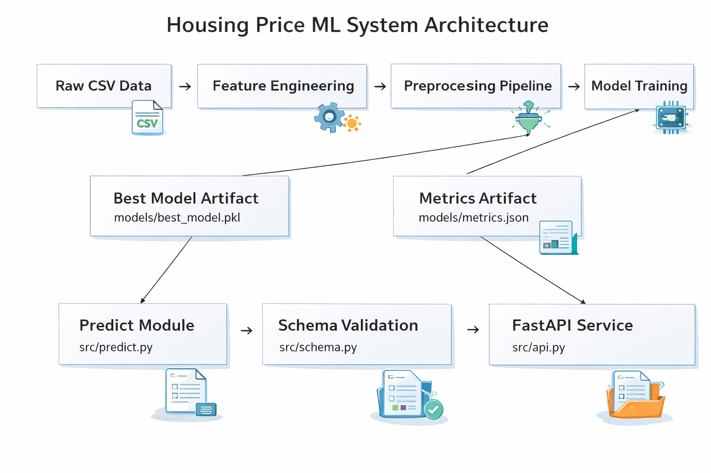

# housing-price-ml-system

Production-ready regression system for Islamabad housing price prediction, covering the full ML lifecycle: data analysis, preprocessing, feature engineering, model comparison, model packaging, prediction API, and Docker deployment.

## Project Overview
This project trains and serves a housing-price regression model from `data/Islamabad houses.csv`.

It is designed as a practical production template with:
- clear stage separation
- typed Python modules
- sklearn pipelines for consistent train/inference transformations
- persisted artifacts (`best_model.pkl`, `metrics.json`)
- FastAPI serving interface
- Docker deployment path
- CI quality gates (lint/type/test)

## Dataset Analysis Summary
Initial profiling of `Islamabad houses.csv`:
- Rows: `9,215`
- Columns: `19`
- Target selected: `price_in_lac`
- Leakage columns excluded from training: `price`, `price_per_sqft`
- Missing values concentrated in `agency` and `agent` (`2,659` each)

Final model feature set (aligned to notebook logic + production constraints):
- `location`
- `baths`
- `property_type`
- `city`
- `province_name`
- `bedrooms`
- `Total_Area`
- `area_bins` (engineered)
- `date_added_year` (engineered)
- `date_added_month` (engineered)
- `date_added_day` (engineered)
- `date_added_dayofweek` (engineered)

## System Architecture


## Architecture
Pipeline flow:
1. Load data (`src/preprocessing.py`)
2. Engineer features (`src/feature_engineering.py`)
3. Enforce strict feature contract and ordering (`src/preprocessing.py`)
4. Build preprocessing transformer:
- numeric: median imputation + `StandardScaler`
- categorical: most-frequent imputation + `OneHotEncoder`
5. Train and compare models with 5-fold CV (`src/train.py`)
6. Save best model (`models/best_model.pkl`) and metrics (`models/metrics.json`)
7. Serve predictions through FastAPI (`src/api.py`)

## Repository Structure
```text
housing-price-ml-system/
|-- configs/
|   `-- train.yaml
|-- data/
|   `-- Islamabad houses.csv
|-- src/
|   |-- preprocessing.py
|   |-- feature_engineering.py
|   |-- train.py
|   |-- evaluate.py
|   |-- predict.py
|   |-- schema.py
|   |-- logger.py
|   `-- api.py
|-- tests/
|   |-- test_pipeline.py
|   |-- test_feature_contract.py
|   `-- test_api.py
|-- models/
|-- notebooks/
|   `-- exploration.ipynb
|-- .github/workflows/ci.yml
|-- Dockerfile
|-- LICENSE
|-- requirements.txt
`-- README.md
```

## Config-Driven Training
Training is controlled by `configs/train.yaml`.

Run training:
```bash
python src/train.py --config configs/train.yaml
```

Artifacts created:
- `models/best_model.pkl`
- `models/metrics.json`

Run standalone evaluation on holdout data:
```bash
python src/evaluate.py
```

This writes:
```json
{"mae": ..., "rmse": ..., "r2": ...}
```
to `models/metrics.json`.

## Model Comparison Results (5-Fold CV)
Trained models:
- `LinearRegression`
- `RandomForestRegressor`
- `GradientBoostingRegressor`

Latest run results:

| Model | CV MAE | CV RMSE |
|---|---:|---:|
| RandomForestRegressor | 61.35 | 185.89 |
| GradientBoostingRegressor | 95.47 | 205.43 |
| LinearRegression | 125.27 | 289.08 |

Best model selected automatically: **RandomForestRegressor**.

## Example Output
Training (`python src/train.py --config configs/train.yaml`):
```text
Model Comparison (5-fold CV):
                    model  cv_mae_mean  cv_mae_std  cv_rmse_mean  cv_rmse_std
    RandomForestRegressor    61.347759    7.118730    185.891972    42.250142
GradientBoostingRegressor    95.470980    6.407042    205.432094    34.781037
         LinearRegression   125.266073    8.657049    289.083829    37.510326

Best model: RandomForestRegressor
Saved model to: models\best_model.pkl
Saved metrics to: models/metrics.json
```

Evaluation (`python src/evaluate.py`):
```text
Evaluation complete:
- MAE:  21.9242
- RMSE: 61.1452
- R2:   0.9833
Saved evaluation metrics to: models/metrics.json
```

## Prediction (Python)
```python
from src.predict import predict_price

payload = {
    "property_type": "House",
    "location": "DHA Defence",
    "city": "Islamabad",
    "province_name": "Islamabad Capital",
    "baths": 4,
    "bedrooms": 4,
    "date_added": "2023-05-11",
    "Total_Area": 12.0
}

price_in_lac = predict_price(payload)
print(price_in_lac)
```

## API Usage
Run API locally:
```bash
uvicorn src.api:app --host 0.0.0.0 --port 8000
```

Health check:
```bash
curl http://localhost:8000/health
```

Prediction request:
```bash
curl -X POST http://localhost:8000/predict \
  -H "Content-Type: application/json" \
  -d '{
    "property_type": "House",
    "location": "DHA Defence",
    "city": "Islamabad",
    "province_name": "Islamabad Capital",
    "baths": 4,
    "bedrooms": 4,
    "date_added": "2023-05-11",
    "Total_Area": 12.0
  }'
```

Response shape:
```json
{
  "predicted_price_in_lac": 51.288
}
```

## Quality Gates
Run locally:
```bash
ruff check src tests
mypy src
pytest -q
```

CI workflow executes the same checks on push/PR.

## Docker
Build:
```bash
docker build -t housing-price-ml-system .
```

Run:
```bash
docker run --rm -p 8000:8000 housing-price-ml-system
```

## Production Extension Ideas
- Store training data and artifacts on S3
- Add experiment tracking and model registry via MLflow
- Add CI/CD pipeline for model validation and container publishing
- Add drift monitoring and scheduled retraining
- Add feature contracts and schema validation at API boundary
