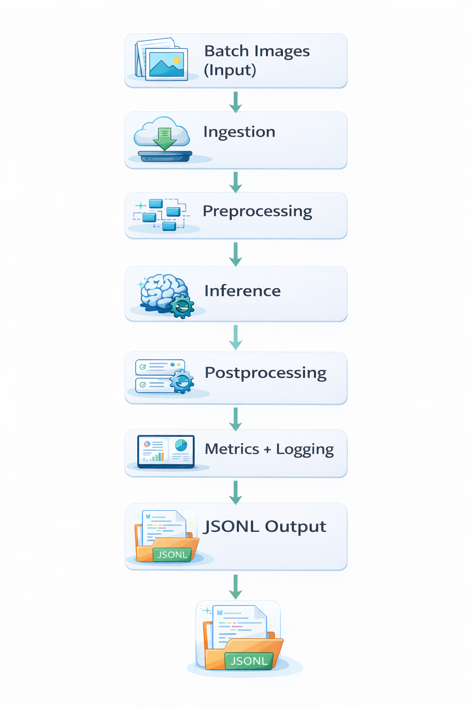

# ML Production Pipeline Template

Production-ready ML batch pipeline template with modular stages, config-driven execution, structured logging, retry-based failure handling, and Docker support.

## Overview
This repository is a template for production-style machine learning batch workflows. It emphasizes practical engineering signals expected in US ML engineering roles: modular architecture, reliability patterns, observability, typed Python, configuration-driven behavior, and testability.

## Architecture Diagram


## Pipeline Stages
1. Ingestion: Load image files in configurable batches.
2. Preprocessing: Apply a deterministic preprocessing stage.
3. Inference: Run model scoring (dummy inference in this template).
4. Postprocessing: Convert scores to labeled outputs.
5. Monitoring: Emit metrics per batch.
6. Persistence: Write structured outputs as JSONL.

## Repository Structure
```text
ml-production-pipeline-template/
|-- src/
|   |-- config/config.yaml
|   |-- ingestion/data_loader.py
|   |-- preprocessing/image_preprocessor.py
|   |-- inference/model_runner.py
|   |-- postprocessing/result_formatter.py
|   |-- monitoring/metrics.py
|   |-- utils/logger.py
|   |-- utils/retry.py
|   |-- utils/io.py
|   `-- pipeline.py
|-- tests/test_pipeline.py
|-- docker/Dockerfile
|-- requirements.txt
|-- .gitignore
|-- README.md
`-- architecture.png
```

## Config-Driven Execution
Default config: `src/config/config.yaml`

```yaml
environment: local

batch:
  size: 8
  max_retries: 3

paths:
  input_dir: data/input
  output_dir: data/output

logging:
  level: INFO
```

Run locally:
```bash
python -m src.pipeline
```

Example inference run:
```bash
python src/pipeline.py
```

## Failure Handling
- Each batch is wrapped in retry logic (`max_retries` in config).
- Failed batches are logged with stack traces.
- Batch-level success metrics are still emitted for visibility.

## Logging and Observability
- Structured logger format: `timestamp | logger | level | message`
- Batch metrics emitted through `src/monitoring/metrics.py`
- Final outputs persisted to `data/output/predictions.jsonl`

## Docker Execution
Build image:
```bash
docker build -f docker/Dockerfile -t ml-pipeline-template .
```

Run container:
```bash
docker run --rm -v "${PWD}/data:/app/data" ml-pipeline-template
```

## Testing
Run unit tests:
```bash
pytest -q
```

## Production Extension Notes
- Replace dummy inference with real model serving/runtime wrappers.
- Add schema validation for configs and outputs.
- Add centralized metrics export (Prometheus/OpenTelemetry).
- Add CI checks for lint, type checks, and tests.

## Future Improvements
- Airflow DAG orchestration for scheduled runs.
- AWS Batch or ECS execution for scalable batch processing.
- S3-native input/output adapters.
- Feature store and model registry integrations.
- Dead-letter queue for failed batch records.
